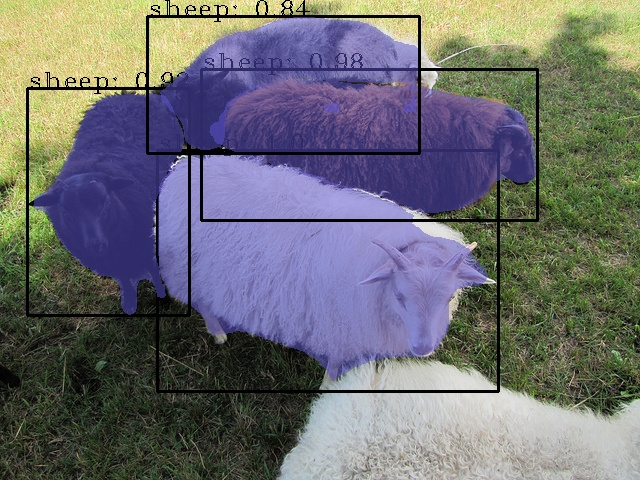

[](https://opensource.org/licenses/BSD-3-Clause)

# OpenPPL Backend

The Triton backend for the [OpenPPL](https://github.com/openppl-public/ppl.nn). You can learn more
about Triton server in the [Triton Inference Server](https://github.com/triton-inference-server/server)
and Triton backends in the [Triton Backend](https://github.com/triton-inference-server/backend).


# Triton Inference Server OpenPPL Backend

OpenPPL Backend For Triton Inference Server. Our repo contains largs files, you need to [install git-lfs](https://github.com/git-lfs/git-lfs/wiki/Installation) before clone the repo.

## QuickStart

All these steps are following [Triton server QuickStart](https://github.com/triton-inference-server/server/blob/main/docs/quickstart.md).

### Install Triton Docker Image

Before you can use the Triton Docker image you must install
[Docker](https://docs.docker.com/engine/install). If you plan on using
a GPU for inference you must also install the [NVIDIA Container
Toolkit](https://github.com/NVIDIA/nvidia-docker). DGX users should
follow [Preparing to use NVIDIA Containers](http://docs.nvidia.com/deeplearning/dgx/preparing-containers/index.html).


## Create A Model Repository

The [model repository](https://github.com/triton-inference-server/server/blob/main/docs/model_repository.md) 
is the directory where you place the models that you want Triton to serve. 
An sample model repository is shown on [sample file](sample/models)

```
models/
    maskrcnn/
      config.pbtxt
      1/
        model.onnx
```

Model platform name should be `openppl_onnx`.

## Run Triton Sever

OpenPPL backend can only work on GPU systems.

### Run on System with GPUs

Use docker pull from DockerHub. You need to register an account before docker pull.

```
$ docker pull ppltriton/ppltriton:v01
```

Run docker.

```
$ docker run --gpus=1 --rm -p8000:8000 -p8001:8001 -p8002:8002 -v/`pwd`/sample/models:/models ppltriton/ppltriton:v01 /opt/citritonbuild/opt/tritonserver/bin/tritonserver  --model-repository=/models --backend-directory=/opt/citritonbuild/opt/tritonserver/backends/
```

After you start Triton you will see output on the
console showing the server starting up and loading the model. When you
see output like the following, Triton is ready to accept inference
requests.

```
+----------------------+---------+--------+
| Model                | Version | Status |
+----------------------+---------+--------+
| <model_name>         | <v>     | READY  |
| ..                   | .       | ..     |
| ..                   | .       | ..     |
+----------------------+---------+--------+
...
...
...
I1002 21:58:57.891440 62 grpc_server.cc:3914] Started GRPCInferenceService at 0.0.0.0:8001
I1002 21:58:57.893177 62 http_server.cc:2717] Started HTTPService at 0.0.0.0:8000
```
All the models should show "READY" status to indicate that they loaded correctly. If a model fails to load the status will report the failure and a reason for the failure. If your model is not displayed in the table check the path to the model repository and your CUDA drivers.


### Running The Image Detection Example

An client example was included in [sample_maskrcnn.py](sample/client/sample_maskrcnn.py). You can test the example by following commands.

```
$ pip3 install tritonclient[all]
$ cd sample/client/
$ python3 sample_maskrcnn.py -i test.jpg
```

Maskrcnn model will detect the tested picture as below:

